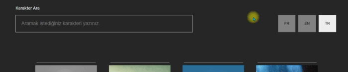
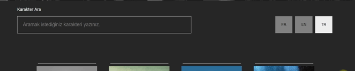

# Version 2.0

### [Click to try version 2 live](https://react-marvel-v2.netlify.app/)

- Character Search Bar
- Character Detail Page
- Translation In 3 Languages

Search bar example


Translation example


Character detail page example


## Version 1.0

### [Click to try version 1 live](https://huseyin-react-marvel-1.netlify.app/)

---

When the site is entered, the necessary data is saved to the session storage. When the page is re-entered, no load is created on the api.

This is what is meant in the image below.


---

An example of the responsive work of the site is the following image.


---

If you want to try the project in your local. Download(or clone) the project. Create .env file in home directory and fill it as below.

```bash
REACT_APP_API_BASE_URL = https://gateway.marvel.com
REACT_APP_PUBLIC_KEY = < your public api key >
REACT_APP_PRIVATE_KEY = < your private api key >
```
